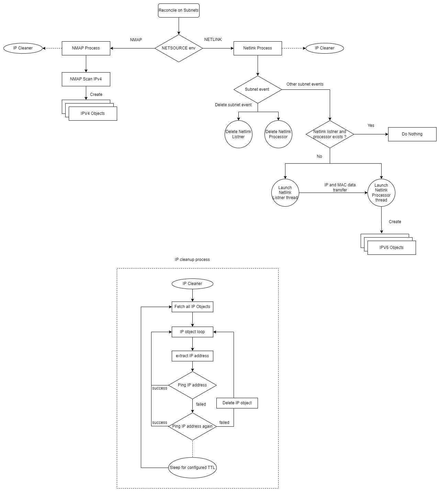

# netdata
[](http://makeapullrequest.com) 
[](LICENSE)

## Overview
The Netdata is an utility which scans or discovers the servers from the network by using NMAP protocol

### Subnet scan cron job
1. In this cron job all subnets are fetched and scanned parallelly.
2. The IPv4 subnet is scanned using 
3. The IPv6 subnet is scanned using the golang lib and a .nse script file present in the repository.
4. Each NMAP scan is executed in parallel using go routines.
5. The output received from a scan is processed to get the IP and MAC. Using an IP address and a MAC an IP object is created.
6. The cron job is executed periodically using the configured interval from the config map.

### IP object Cleanup cron job
1. In this cron job all IP objects are fetched from the k8s cluster.
2. From the IP object an IP address is parsed and it is pinged. If the IP address is not reachable, it gets deleted after the retry mechanism.
3. Nothing is done if the ping is successful.
3. The cron job is executed periodically using the configured interval from the config map.

#### Workflow



## Contributing

We'd love to get feedback from you. Please report bugs, suggestions or post questions by opening a GitHub issue.

### How it works
This project aims to follow the Kubernetes [Operator pattern](https://kubernetes.io/docs/concepts/extend-kubernetes/operator/)

It uses [Controllers](https://kubernetes.io/docs/concepts/architecture/controller/) 
which provides a reconcile function responsible for synchronizing resources untile the desired state is reached on the cluster 

## License

Copyright 2023.

Licensed under the Apache License, Version 2.0 (the "License");
you may not use this file except in compliance with the License.
You may obtain a copy of the License at

    http://www.apache.org/licenses/LICENSE-2.0

Unless required by applicable law or agreed to in writing, software
distributed under the License is distributed on an "AS IS" BASIS,
WITHOUT WARRANTIES OR CONDITIONS OF ANY KIND, either express or implied.
See the License for the specific language governing permissions and
limitations under the License.


### Build image

```
USE_EXISTING_CLUSTER=true make test
eval $(minikube -p minikube podman-env)
make podman-build
make podman-push
```


### Logs

```
kubectl logs -f -lcontrol-plane=controller-manager --all-containers=true
```

### Build local execution file with [capabilities](https://man7.org/linux/man-pages/man7/capabilities.7.html)

```
CGO_ENABLED=0 GOOS=linux GOARCH=amd64 GO111MODULE=on go build -a -o manager main.go
setcap cap_net_raw,cap_net_admin,cap_net_bind_service+eip ./manager
export NETSOURCE=ndp
export KUBECONFIG=~/.kube/config
./manager


```

### debug
```
export DEBUG=TRUE
```
